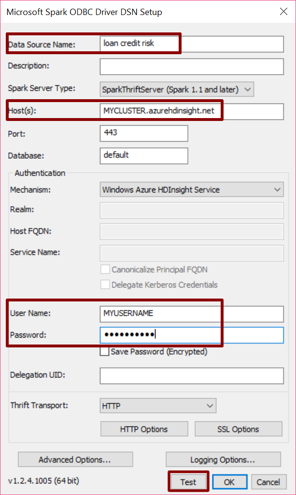
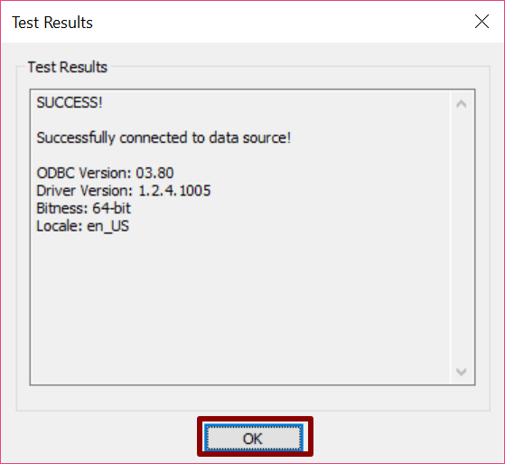

 This page describes the 
<strong>
{{ site.cig_text }}
{{ site.onp_text }}
{{ site.hdi_text }} 
</strong>
solution.
 

 

## Set up Connection between Hive and PowerBI  

Follow the instructions below to set up a connection between your Hive table and PowerBI.  Perform these steps after you have <a href="Typical.html">created the Hive tables by executiong the <strong>development_main.R</strong> and <strong>production_main.R</strong> </a> scripts.

<ol>
<li class="hdi">Download and install the <a href="https://www.microsoft.com/en-us/download/details.aspx?id=49883">Spark ODBC driver.</a> If you already have this driver, make sure it version 1.2.4.1005 or greater. </li>
<li>	Push the <code>Windows</code> key on your keyboard</li>
<li>	Type <code>ODBC</code> </li>
<li>	Open the correct app depending on what type of computer you are using (64 bit or 32 bit). To find out if your computer is running 32-bit or 64-bit Windows, do the following:
<ul>
<li>	Open System by clicking the <code>Start</code> button, clicking <code>Control Panel</code>, clicking <code>System and Maintenance</code>, and then clicking <code>System</code>.</li>
<li>.	Under System, you can view the system type</li>
</ul>
</li>
<li>	Click on <code>Add</code>
   

</li>
<li>
Select <code>Microsoft Spark ODBC Driver</code> and click <code>Finish</code>
</li>
<li >
Under Name, Enter <code>loan credit risk</code>. (Make sure you use this name exactly as shown here as it is the one PowerBI expects.)  Add the Host name (of the form <i>myclustername.azurehdinsight.net</i>).  
 

</li>

<li>
Press <code>Test</code>.
</li> 
<li>	Press <code>OK</code> in the new popover. This will close the popover and return to the previous popovers.
 

</li>
<li>	Now that the Data Source is tested. Press <code>OK</code>.
</li>
<li>	Finally, click <code>OK</code> and close the window.
</li>

You are now ready to use this connection in PowerBI. <a href="Visualize_Results.html">Return to  Visualizing Results with PowerBI</a>.

