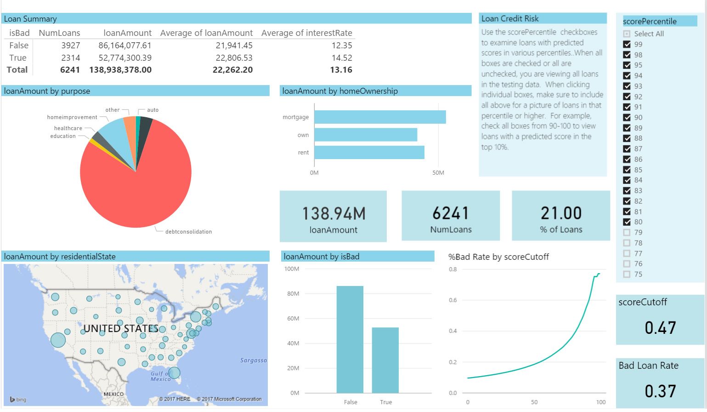
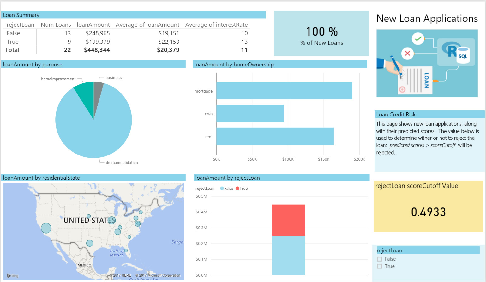

 This page describes the 
<strong>
{{ site.cig_text }}
{{ site.onp_text }}
{{ site.hdi_text }} 
</strong>
solution.


 

## For the Business Manager
------------------------------

This solution is based on simulated data for a small personal loan financial institution, containing the borrower's financial history as well as information about the requested loan.  It uses predictive analytics to help decide whether or not to grant a loan for each borrower.

 
SQL Server R Services takes advantage of the power of SQL Server 2016 and ScaleR (Microsoft R Server package) by allowing R to run on the same server as the database. It includes a database service that runs outside the SQL Server process and communicates securely with the R runtime. 

This solution shows how to preprocess data, create new features, train R models, and perform predictions in-database. The final table in the SQL Server database provides a predicted value for each borrower. This predicted value, which can be interpreted as a probability of default, can help you determine whether you wish to approve the loan.

Microsoft R Server on HDInsight Spark clusters provides distributed and scalable machine learning capabilities for big data, leveraging the combined power of R Server and Apache Spark. This solution demonstrates how to develop machine learning models for loan credit risk (including data processing, feature engineering, training and evaluating models), deploy the models as a web service (on the edge node) and consume the web service remotely with Microsoft R Server on Azure HDInsight Spark clusters. 

The final table is saved to a Hive table containing XXX. This data is then visualized in Power BI.

The PowerBI dashboard allows you to visualize and use these predicted scores to aid in deciding when to approve a loan.  There are two different tabs: the Test Data tab lets you explore the scores in the test data in order to decide on a cutoff values to use in the decision to reject a loan.  The Prod Data tab  shows  new potential loans in the production pipeline where you can view the results of using this cutoff value.  

### Test Data Tab

The output scores from the model have been binned according to the percentiles: the higher the percentile, and the most likely the risk of default.  On the Test Data tab, you can use the checkboxes at the top right to examine loans in the test data that correspond to these percentiles. Start by unchecking all boxes, which shows the entire test set. Then starting at the top (99%), check consecutive boxes to view characteristics of those loans whose scores fall into that percentile or above. This  corresponds to a specific choice of a score cutoff value which is shown directly below the checkboxes. For example, for percentiles of 81 and above, the score cutoff is .4933, which means that all scores higher than 0.4933 will be classified as bad. Among those loans classified as bad, the real or expected bad rate is indicated in the box below ( 40%). 

The Loan Summary table divides those loans classified as bad in two: those that were indeed bad (Bad Loan = Ues) and those that were in fact good although they were classified as bad (Bad Loan = No). For each of those 2 categories, the table shows the number, total and average amount, and the average interest rate of the loans. This allows you to see the expected impact of choosing this cutoff value.

### New Loans Tab

On the New Loans tab you will see some scored potential loans. This page is using .4933 as the cutoff value. You will reject 9 of the 22 potential loans based on this critera. (With PowerBI Desktop, you can change this cutoff to a different value.)

 

 



To understand more about the entire process of modeling and deploying this example, see [For the Data Scientist](data-scientist.html).
 

[&lt; Home](index.html)
