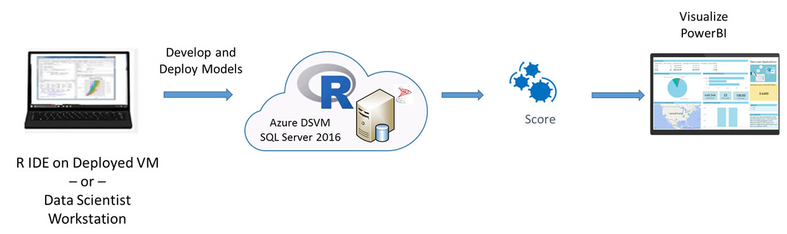
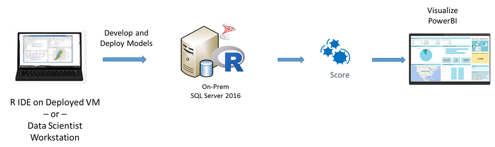
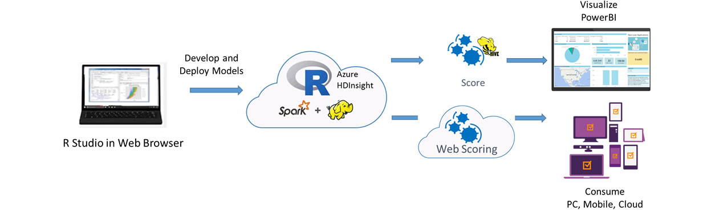

Are you unable to connect to your Virtual Machine? See this important information for
<a href="https://blogs.technet.microsoft.com/mckittrick/unable-to-rdp-to-virtual-machine-credssp-encryption-oracle-remediation/">how to resolve.</a>

If we had a crystal ball, we would only loan money to someone if we knew they would pay us back. A lending institution can make use of predictive analytics to reduce the number of loans it offers to those borrowers most likely to default, increasing the profitability of its loan portfolio. This is commonly called credit risk scoring or loan default optimization.

The solution presented here uses simulated data for a small personal loan financial institution, containing the borrower's financial history as well as information about the requested loan. A model is created to predict whether a borrower will default. This model is used to help decide whether or not to grant a loan for each borrower.

The Microsoft Loan Credit Risk solution is a combination of a Machine Learning prediction model and an interactive visualization tool, PowerBI. The solution is used to reduce the risk of borrowers defaulting on their loan and not being able to pay (part of) their loan to the lender.

<h2>Select the method you wish to explore:</h2>
 <form style="margin-left:30px"> 
    <label class="radio">
      <input type="radio" name="optradio" class="rb" value="cig" > {{ site.cig_text }}, deployed from the <a href="START_HERE.html">Quick Start Page</a>
    </label>
    <label class="radio">
      <input type="radio" name="optradio" class="rb" value="onp"> {{ site.onp_text }}
    </label>
   <label class="radio">
      <input type="radio" name="optradio" class="rb" value="hdi"> {{ site.hdi_text }}, deployed from the <a href="START_HERE.html">Quick Start Page</a>
    </label> 
</form>

On the VM created for you using the 'Deploy to Azure' button on the <a href="START_HERE.html">Quick start</a> page, the SQL Server 2017 database <code>{{ site.folder_name }}</code> contains all the data and results of the end-to-end modeling process.  

For customers who prefer an on-premise solution, the implementation with SQL Server R Services is a great option that takes advantage of the powerful combination of SQL Server and the R language.  A Windows PowerShell script to invoke the SQL scripts that execute the end-to-end modeling process is provided for convenience. 

This solution shows how to pre-process data (cleaning and feature engineering), train prediction models, and perform scoring on the  HDInsight Spark cluster with Microsoft R Server deployed from using the 'Deploy to Azure' button on the <a href="START_HERE.html">Quick start</a> page.

<strong>HDInsight Spark cluster billing starts once a cluster is created and stops when the cluster is deleted. See <a href="hdinsight.html"> these instructions for important information</a> about deleting a cluster and re-using your files on a new cluster.</strong>

 

